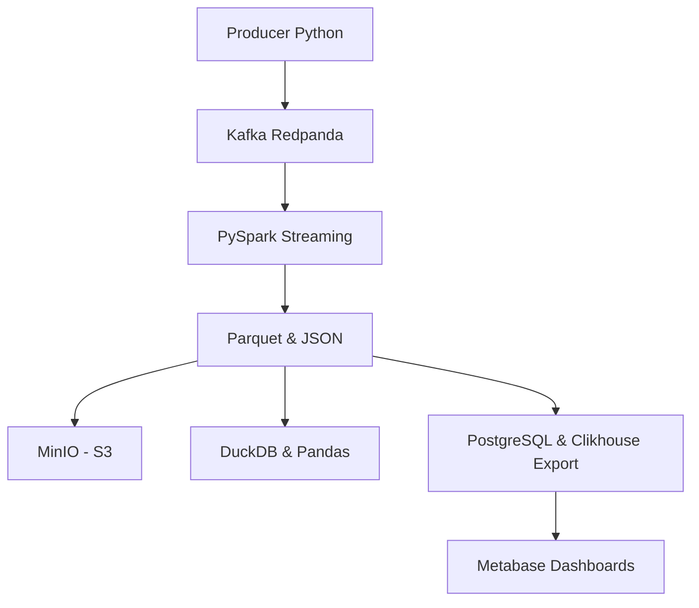

Parfait, voici le **README complet, structuré et détaillé**, intégralement en ligne ici, prêt à être intégré dans ton projet ou remis à ton mentor.

---

# 🧩 Projet — Pipeline de gestion des tickets clients

Ce projet met en place une infrastructure **locale et hybride** de traitement de données en **temps réel**, construite autour des composants suivants : **Redpanda (Kafka)**, **Spark Streaming**, **MinIO**, **PostgreSQL**, **ClickHouse**, **DuckDB**, et **Metabase**.  
L’objectif est de simuler un système de gestion de tickets clients et d’implémenter un **pipeline complet** allant de l’ingestion jusqu’à l’analyse et la visualisation.

---

## 🧱 Infrastructure technique

L’infrastructure est entièrement orchestrée via **Docker Compose** (`docker-compose.infra.yml`) et se base sur les services suivants :

- **Redpanda** : système Kafka-compatible pour gérer les messages en temps réel.
- **MinIO** : stockage objet S3-compatible (équivalent Amazon S3).
- **PostgreSQL** : base relationnelle utilisée pour l’export structuré des tickets.
- **ClickHouse** : base analytique (OLAP) pour le reporting massif.
- **Metabase** : outil no-code de visualisation des données.
- **PySpark** : pour lire, enrichir et transformer les flux Kafka.
- **DuckDB / Pandas** : pour une analyse légère, rapide et locale.
- **Producer Kafka** : simule des tickets clients.
- **Consumer** (facultatif) : consomme les messages Kafka.

---

## 🛠️ Lancement de la stack Docker

Avant de commencer, assurez-vous d’avoir Docker installé.

```bash
docker-compose -f docker-compose.infra.yml up --build -d
```

> 📁 Toutes les variables sensibles (identifiants, ports, accès) sont dans le fichier `.env`.

Pour arrêter proprement :

```bash
docker-compose -f docker-compose.infra.yml down -v
```

---

## 🔄 Schéma d’architecture globale (Mermaid)



---

## 🧪 Étapes du pipeline

### 1. Génération des données — `producer_tickets.py`

Ce script simule des tickets clients à l’aide de `Faker`. Chaque ticket contient :
- `ticket_id`
- `client_id`
- `created_at`
- `request`
- `request_type` (support, facturation, technique, commercial…)
- `priority`

Les messages sont envoyés dans le topic Kafka `client_tickets` via Redpanda.

Commande manuelle :
```bash
python src/producer_tickets.py --count 100 --interval 0.5
```

> Ce service est également **dockerisé** avec `Dockerfile.producer` et automatisé dans le compose.

---

### 2. Traitement en streaming — `pyspark_streaming_export_minio.py`

Ce script :
- consomme les messages depuis Kafka (Redpanda),
- transforme les messages en DataFrame Spark,
- enrichit les données en ajoutant une colonne `assigned_team`,
- exporte les données toutes les 15 secondes en :
  - `.parquet` (format optimisé),
  - `.json` (brut lisible),
  - vers `MinIO` via `s3a://...`.

Commande :
```bash
spark-submit --packages org.apache.spark:spark-sql-kafka-0-10_2.12:3.5.0,org.apache.hadoop:hadoop-aws:3.3.1 src/pyspark_streaming_export_minio.py
```

> Dockerisé avec `Dockerfile.pyspark`, exposé dans le conteneur `spark-tickets`.

---

### 3. Analyse locale — `analyse_tickets_exportes.py`

Ce script permet d’explorer les fichiers `.parquet` produits localement (ou via MinIO) à l’aide de **DuckDB** et **Pandas** :
- groupement des tickets par priorité, type, équipe assignée,
- création d’un graphique PNG de répartition,
- export CSV du rapport.

```bash
python src/analyse_tickets_exportes.py
```

---

### 4. Export structuré — PostgreSQL ou ClickHouse

#### `export_to_postgres.py`
Lit les fichiers `.parquet` et insère les données dans PostgreSQL :
```bash
python src/export_to_postgres.py
```

#### `export_to_clickhouse.py`
Fait le même traitement vers ClickHouse :
```bash
python src/export_to_clickhouse.py
```

---

## 📊 Visualisation avec Metabase

Une fois les données injectées dans PostgreSQL :
1. Lancer `http://localhost:3000`
2. Ajouter PostgreSQL comme source de données
3. Créer des tableaux de bord sur la table `tickets_analysis`

> Permet d'explorer les données en mode **no-code**.

---

## 📂 Arborescence du projet

```
.
├── docker/
│   ├── Dockerfile.producer
│   ├── Dockerfile.pyspark
│   └── Dockerfile.consumer
├── data/
│   └── outputs/                  # Export Parquet/JSON
├── src/
│   ├── producer_tickets.py
│   ├── pyspark_streaming_export_minio.py
│   ├── analyse_tickets_exportes.py
│   ├── export_to_postgres.py
│   ├── export_to_clickhouse.py
│   └── consumer_tickets.py
├── .env
├── requirements.txt
├── docker-compose.infra.yml
└── README.md
```

---

## 📦 Installation manuelle (hors Docker)

1. Créer un environnement virtuel :
```bash
python -m venv venv
source venv/bin/activate  # ou venv\\Scripts\\activate sous Windows
```

2. Installer les dépendances :
```bash
pip install -r requirements.txt
```

---

## 🧾 À noter

- Tous les scripts sont conçus pour être utilisés **indépendamment** ou dans le cadre d’un **pipeline automatisé**.
- L’export vers MinIO simule un usage type S3, sans coût cloud.
- La transformation Spark est **streamée**, donc déclenchée automatiquement toutes les 15 secondes.
- DuckDB permet de faire des requêtes SQL localement sans serveur.

---

## ✅ Résultat final

Ce projet simule un pipeline complet de traitement de données, du **flux en temps réel** jusqu’à la **visualisation métier**, sans dépendance à un cloud externe. Il peut servir de base à une future **migration vers une architecture hybride ou full-cloud**.

 